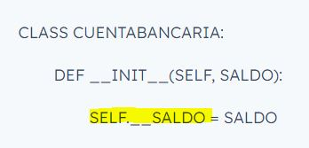

## ¿Para qué usamos Clases en Python?

Una clase es esencialmente un plano o un *molde para la creación de objetos*. Por ejemplo, una clase **perro** podría definir todos los atributos y métodos que queremos que tengan los **objetos de clase perro**.

Las clases en Python proveen una forma de **empaquetar datos y funcionalidad** juntos. Al crear una nueva clase, se crea un nuevo *tipo* de objeto, permitiendo crear nuevas **instancias** de ese *tipo*. Por ello se puede decir que son la estructura principal en la ***programación orientada a objetos.***

Las clases se crean utilizando la palabra reservada ***class***, seguido por el **nombre** de la clase y **dos puntos**. Luego, se definen los *métodos y atributos* como una **función** dentro de la clase.

- ***Métodos:***

    En Python, los métodos son **funciones definidas dentro de las clases** y se utilizan para realizar operaciones en los objetos creados a partir de esa clase.

    Cuando se crea una **instancia de una clase**, los métodos se pueden **llamar** en la instancia del objeto utilizando la sintaxis ***objeto.metodo()***. Además, como los métodos están definidos dentro de una clase, tienen acceso a todas las propiedades y otros métodos de esa clase.

    La **sintaxis** de la definición de un método es similar a la sintaxis de la **definición de una función** en Python, excepto que se define **dentro** de una clase y requiere el ***parámetro self***, que hace referencia al objeto en el que se está llamando el método.

- ***Atributos:***

    Un atributo es una **variable que se define dentro de una clase**, la cual **almacena datos** que pertenecen a un objeto de esa clase. Se utilizan para representar características o propiedades de un objeto, como su estado actual, su identificador, su tamaño, su color, etc.
    
    Pueden ser de **diferentes tipos de datos**, como enteros, flotantes, cadenas, listas, diccionarios, entre otros. 
    
    Además, en Python los atributos de una clase pueden tener **distintos niveles de visibilidad**, que se especifican mediante los **modificadores de acceso** en la definición de la clase. Los ***tres tipos principales*** de atributos son:
    
    - **Atributos públicos**: se puede **acceder a ellos desde cualquier parte del programa**, incluso desde fuera de la clase. En Python, los atributos se consideran públicos *por defecto*, lo que significa que no se requiere ningún modificador de acceso para especificar que un atributo es público. Para acceder a un atributo público, se utiliza la notación de punto (.) seguida del nombre del atributo.

    - **Atributos privados**: solo se puede **acceder a ellos desde dentro de la clase en la que se definen**. En Python, los atributos privados se definen mediante el prefijo **«__» (dos guiones bajos)** seguido del nombre del atributo. Por ejemplo, si queremos definir un atributo privado llamado *saldo* en una clase llamada *CuentaBancaria*, podemos hacerlo de la siguiente manera:

        

    - **Atributos protegidos**: solo se puede **acceder a ellos desde dentro de la clase en la que se definen y desde las clases heredadas (clases hijas) de esa clase**. En Python, los atributos protegidos se definen mediante el prefijo **«_» (un guion bajo)** seguido del nombre del atributo. 

En el siguiente ejemplo, hemos creado la clase ***Perro*** con tres **atributos**: *nombre, raza y edad*. También hemos creado el **método saludar**, que simplemente imprime una cadena de texto que incluye el nombre y edad del perro.

Vemos en nuestro ejemplo que la primera función es **\_\_init__**, de la cual voy a hablar en la siguiente pregunta, por lo que aquí solo voy a mencionar que es un método especial (también llamado **método dunder**) en Python que se utiliza para **inicializar una instancia de una clase**. 

Una vez creada la clase, podemos ***instanciar objetos*** de la misma (crear un objeto con esa clase). Para hacerlo, simplemente llamamos al nombre de la clase seguido de paréntesis:

En este ejemplo, hemos creado un objeto de la clase *Perro* llamado **mi_perro**, con el nombre *Firulais*, raza *Chihuahua* y edad *5*. Luego llamamos al **método saludar** sobre este objeto, lo que imprimirá en la consola la cadena de texto definida en el método:

    ¡Hola, soy un perro llamado Firulais y tengo 5 años!

La programación orientada a objetos es útil porque permite ***encapsular datos y comportamientos*** relacionados en un solo objeto. En el ejemplo anterior, encapsulamos el nombre, raza y edad del perro en un **objeto mi_perro**, y también definimos un comportamiento (el método saludar) que funciona específicamente con este objeto.

## ¿Qué método se ejecuta automáticamente cuando se crea una instancia de una clase?

Cuando se crea una instancia de una clase, el método **\_\_init__** es llamado automáticamente por el intérprete de Python y se utiliza para realizar cualquier **inicialización** que sea necesaria para la instancia.

El método __init__ se usa para **asignar valores iniciales** a los **atributos** de una instancia de la clase. Al llamar al método **\_\_init__**, podemos establecer los valores de estos atributos y configurar la instancia de la clase para su uso posterior.

Por ejemplo, supongamos que queremos crear una clase llamada **Persona** con dos **atributos**: *nombre* y *edad*. Podríamos definir la clase de la siguiente manera:

        class Persona:
            def __init__(self, nombre, edad):
                self.nombre = nombre
                self.edad = edad

Al crear una instancia de la clase **Persona**, se debe proporcionar un valor para cada uno de los parámetros, nombre y edad, como en el siguiente ejemplo:

        personaUno = Persona("Pepi", 99)

Ahora puedes revisar el ejemplo de la pregunta anterior. 

Teníamos la clase **Perro**, donde el método **\_\_init__** toma dos argumentos de entrada (**self**, que se refiere al objeto que se está creando, y *nombre, raza y edad*, que se definen como **atributos** del objeto) y asigna esos valores a los atributos del objeto (self.nombre, self.raza y self.edad).

Después, hemos creado la instancia *mi_perro*, con los siguientes valores:

        mi_perro = Perro("Firulais", "Chihuahua", 5)

## ¿Cuáles son los tres verbos de API?

Los verbos HTTP le indican al servidor qué hacer con los datos identificados por la URL. 

Los **tres verbos más importantes** son los siguientes:

- **GET**

    GET es el método de solicitud HTTP más simple de todos. Es la que usan los navegadores cada vez que hace clic en un enlace o escribe una URL en la barra de direcciones. 
    
    GET es el que usamos para **obtener un recurso**, lo que indica al servidor que transmita los datos identificados por la URL al cliente. 
    
    Las peticiones GET no deben causar efectos secundarios en un servidor, es decir, **no deben producir nuevos registros, ni modificar los ya existentes**. A esta cualidad la llamamos **idempotencia**, cuando una acción ejecutada un número indefinido de veces, produce siempre el mismo resultado. En este sentido, una petición GET es de sólo lectura; por supuesto, una vez que el cliente recibe los datos, es libre de hacer cualquier operación con ella por su cuenta, por ejemplo, formatearla para su visualización.

- **POST**

    Las peticiones con POST son para **crear recursos nuevos**, no para eliminarlos, ni para modificarlos. Cada llamada con POST debería producir un nuevo recurso.

    Algunos escenarios más complejos para el uso de POST son los inicios de sesión, agregar a un carrito de compras, procesar un pago nuevo, etc.

    Consideremos por ejemplo el inicio de sesión, normalmente al iniciar sesión, no producimos un nuevo registro en la base de datos, sin embargo, usamos POST porque estamos creando una sesión nueva. Esto nos da a entender que para saber si usaremos POST o no, no necesariamente tenemos que agregar registros en la base de datos, el recurso creado puede ser de otros tipos, como una sesión.

- **PUT**

    Una petición PUT se utiliza cuando se desea crear o actualizar el recurso identificado por la URL.

    La diferencia entre el método PUT y el método POST es que **PUT es un método idempotente**: llamarlo una o más veces de forma sucesiva tiene el mismo efecto (sin efectos secundarios), mientras que una sucesión de **peticiones POST idénticas** pueden tener efectos adicionales, como **envíar una orden varias veces**.

## ¿Es MongoDB una base de datos SQL o NoSQL?

MongoDB es un DBMS de **código abierto, NoSQL y orientado a documentos**. MongoDB Inc. ofrece una suite integrada de servicios cloud de bases de datos, así como soporte comercial. Se suele usar para almacenar grandes volúmenes de datos.

Al ser una base de datos **NoSQL documental**, es una de las bases más versátiles y se pueden usar en una amplia gama de proyectos. Permiten realizar **consultas más avanzadas** sobre el contenido de un **documento**, además de consultas de **clave-valor**. Se apoyan en estructuras simples como **JSON o XML**. 

NoSQL es la abreviatura de ***Not only SQL***. Es decir, la mayoría de las bases de datos NoSQL no usan el lenguaje SQL para consultas, o lo usan como un lenguaje secundario.

Son bases de datos no relacionales que ofrecen una arquitectura distribuida que permite almacenar información en casos en los que las bases de datos relacionales no son capaces de ofrecer el **rendimiento y la escalabilidad** necesarios. Al contrario que las BBDD relacionales, **no usan estructuras fijas**. En su lugar, usan diversas **estructuras** de datos flexibles, como los pares de **clave-valor** o los **grafos**, para el almacenamiento y la recuperación de datos.

Mientras que las **bases de datos relacionales están optimizadas para almacenar datos**, las BBDD ***NoSQL*** están optimizadas para ofrecer **escalabilidad horizontal y desarrollo ágil**. Estas son algunas de las **principales características y ventajas** (comparado con las BBDD relacionales) de las bases de datos **NoSQL**:

- **Estructuras de datos flexibles**, en lugar de las relaciones tabulares estándar.
- Baja latencia.
- **Escalabilidad horizontal**.
- Gran número de **usuarios simultáneos**.
- Optimizado para **grandes volúmenes de datos** —ya sean estructurados, semiestructurados o sin - estructurar.
- **Arquitectura distribuida** que permite gestionar grandes cantidades de datos.
- Adaptadas a sprints de desarrollo ágil.
- **Mayor rendimiento, velocidad y escalabilidad**.

## ¿Qué es una API?

Una API (Application Programming Interface) o **interfaz de programación de aplicaciones**, es un conjunto de definiciones y protocolos que se usa para **diseñar e integrar el software de las aplicaciones.**

Las API permiten que sus **productos y servicios se comuniquen con otros**, sin necesidad de saber cómo están implementados. Esto simplifica el desarrollo de las aplicaciones y permite ahorrar tiempo y dinero. Las API otorgan **flexibilidad**: simplifican el diseño, la administración y el uso de las aplicaciones. También ofrecen **oportunidades de innovación**, lo cual es ideal al momento de diseñar herramientas y productos nuevos (o de gestionar los actuales).

También permiten la colaboración entre el equipo **comercial** y el de **TI**, ya que simplifican la forma en que los desarrolladores integran los elementos de las aplicaciones nuevas en una arquitectura actual.

El desarrollo de **aplicaciones nativas de la nube** es una forma identificable de aumentar la velocidad de desarrollo y se basa en la **conexión** de una arquitectura de **aplicaciones de microservicios** a través de las API.

Las API son un medio simplificado para conectar su propia infraestructura a través del desarrollo de aplicaciones nativas de la nube, pero también le permiten **compartir sus datos con clientes y otros usuarios** externos. Las API públicas aportan un valor comercial único porque simplifican y amplían sus conexiones con los partners y, además, pueden rentabilizar sus datos (un ejemplo conocido es la API de Google Maps).

**Políticas de lanzamiento** de las API:

- ***Privado***: las API solo se pueden **usar internamente**, así que las empresas tienen un mayor control sobre ellas.
- ***De partners***: las API se comparten con partners empresariales específicos, lo cual puede ofrecer **flujos de ingresos adicionales, sin comprometer la calidad**.
- ***Público***: todos tienen acceso a las API, así que otras empresas pueden desarrollar API que interactúen con las de usted y así convertirse en una **fuente de innovaciones**.

## ¿Qué es Postman?

Postman es una popular **herramienta** utilizada para **probar APIs**, permitiendo a los desarrolladores **enviar peticiones** a servicios web y ver respuestas. Es **gratuita** y la puedes usar sin límites, aunque también tiene su versión premium con características extra.

Permite guardar todas las request que queramos, para tenerlas preparadas y poder ejecutarlas las veces que haga falta. Esto facilita mucho el día a día en el desarrollo, pues generalmente habrá que probar una ruta diversas veces hasta que todo funcione como se esperaba.

Además, Postman es muy intuitiva de usar y permite trabajar cómodamente con todos los métodos del HTTP, como GET, POST, PUT, PATCH, DELETE.

## ¿Qué es el polimorfismo?

Python permite la implementación de polimorfismo a través del uso de **herencia y sobreescritura de métodos**. El polimorfismo permite que un objeto se comporte de manera diferente en **distintos contextos**.

En Python, el polimorfismo se implementa de manera natural gracias a la capacidad de las funciones y métodos para **aceptar argumentos de diferentes tipos**. Por lo tanto, para implementar el polimorfismo en la clase ***Automóvil***, simplemente se deben definir **diferentes métodos** que compartan el **mismo nombre** pero que acepten **distintos tipos de argumentos**.

        CLASS AUTOMOVIL:

            DEF __INIT__(SELF, MARCA, MODELO, COLOR, VELOCIDAD_MAXIMA):

                SELF.__MARCA = MARCA

                SELF.__MODELO = MODELO

                SELF.__COLOR = COLOR

                SELF.__VELOCIDAD_MAXIMA = VELOCIDAD_MAXIMA

            DEF ACELERAR(SELF, GAS):

                PRINT("SUMINISTRANDO GAS AL MOTOR:", GAS)

            DEF FRENAR(SELF):

                PRINT("FRENANDO EL AUTOMÓVIL")  
>
        CLASS AUTOMOVILELECTRICO(AUTOMOVIL):

            DEF __INIT__(SELF, MARCA, MODELO, COLOR, VELOCIDAD_MAXIMA, CAPACIDAD_BATERIA):

                SUPER().__INIT__(MARCA, MODELO, COLOR, VELOCIDAD_MAXIMA)

                SELF.__CAPACIDAD_BATERIA = CAPACIDAD_BATERIA

            DEF ACELERAR(SELF, NIVEL_CARGA):

                IF NIVEL_CARGA >= 50:

                    PRINT("EL AUTOMÓVIL ELÉCTRICO ACELERA RÁPIDAMENTE")

                ELSE:

                    PRINT("EL AUTOMÓVIL ELÉCTRICO ACELERA LENTAMENTE")
>
        CLASS AUTOMOVILDEPORTIVO(AUTOMOVIL):

            DEF __INIT__(SELF, MARCA, MODELO, COLOR, VELOCIDAD_MAXIMA, ALERON):

                SUPER().__INIT__(MARCA, MODELO, COLOR, VELOCIDAD_MAXIMA)

                SELF.__ALERON = ALERON

            DEF ACELERAR(SELF, PEDAL_A_FONDO=TRUE):

                IF PEDAL_A_FONDO:

                    PRINT("EL AUTOMÓVIL DEPORTIVO ACELERA RÁPIDAMENTE")

                ELSE:

                    PRINT("EL AUTOMÓVIL DEPORTIVO ACELERA LENTAMENTE")

En este ejemplo, la clase **Automóvil** tiene un método llamado ***acelerar*** que acepta un *argumento gas*, que representa la cantidad de gas que se suministra al motor. Luego, se podrían **definir diferentes versiones** de este método que acepten distintos tipos de argumentos. 

La ***subclase AutomovilElectrico*** redefine el método **acelerar** para aceptar un *argumento nivel_carga*, que representa el nivel de carga de la batería del automóvil eléctrico. Si el nivel de carga es mayor o igual a 50, el automóvil acelera rápidamente; de lo contrario, acelera lentamente.

La ***subclase AutomovilDeportivo*** también redefine el método **acelerar**, esta vez para aceptar un *argumento opcional pedal_a_fondo*. Si este argumento es True, el automóvil deportivo acelera rápidamente; de lo contrario, lo hace lentamente.

## ¿Qué es un método dunder?

En Python, los **métodos dunder** (abreviatura de «*double underscore methods*», también conocidos como **métodos mágicos** o **métodos especiales**) son métodos especiales que tienen un **doble guion bajo** **«__»** al principio y al final de su nombre. Se emplean para ***definir el comportamiento especial de las clases y sus instancias***, y son llamados automáticamente por el intérprete de Python en respuesta a ciertas operaciones.

Los métodos dunder pueden utilizarse para implementar características como la inicialización de objetos, la representación en forma de cadena, la sobrecarga de operadores, la comparación, entre otras.

A continuación, se muestra una lista de algunos de los métodos dunder más comunes en Python:

- **\_\_init__**

    Es un método especial del que hemos hablado en la pregunta ***"¿Qué método se ejecuta automáticamente cuando se crea una instancia de una clase?"***

- **\_\_str__**

    Es otro método especial (dunder) en Python que se utiliza para **devolver una representación de cadena (string)** de una instancia de una clase. Este método se llama cuando se usa la función str() para **convertir un objeto en una cadena de caracteres**.

    En otras palabras, el método **\_\_str__** se emplea para **definir cómo se debe imprimir una instancia** de la clase cuando se llama la ***función str()*** o cuando se utiliza la interpolación de cadenas (f-strings).

    Por ejemplo, supongamos que tenemos una clase **Persona** con los atributos **nombre y edad**. Podemos definir el método **\_\_str__** de la siguiente manera:

    

    En este ejemplo, el método **\_\_str__** devuelve una cadena de caracteres que representa la instancia de la clase **Persona**. La cadena contiene el nombre y la edad de la persona, separados por un espacio.

    Al utilizar la **función str()** con una instancia de la clase **Persona**, se llamará automáticamente al método **\_\_str__**, como en el siguiente ejemplo:

        PERSONA1 = PERSONA("THOR", 2)

        PRINT(STR(PERSONA1)) # THOR (2 AÑOS)

- **\_\_repr__**

    Es un método especial en Python que se utiliza para devolver una **representación de cadena legible de un objeto**. Este método se define dentro de una clase y se llama cuando se usa la ***función repr()*** en un objeto de esa clase.

    La representación de cadena devuelta por **\_\_repr__** debe ser una cadena que sea suficiente para recrear el objeto original. Por lo tanto, se espera que el resultado sea una cadena que contenga información relevante sobre el objeto y sus valores de atributo.

    Es importante tener en cuenta que el método **\_\_repr__** no es lo mismo que el método **\_\_str__**. Este último devuelve una representación de cadena ***legible*** para humanos del objeto (lo que se podría traducir en buena apariencia), mientras que el método **\_\_repr__** devuelve una representación de cadena que es suficiente para recrear el objeto(datos a lo bruto).

    Aquí hay un ejemplo de cómo se puede implementar el método **\_\_repr__** en una clase de Python:

    

        PERSONA2 = PERSONA("NANI", 66)

        PRINT(REPR(PERSONA2)) # PERSONA(NOMBRE=NANI, EDAD=66)

   
Además, **\_\_add__**, **\_\_sub__**, **\_\_mul__** y **\_\_truediv__** se utilizan para sobrecargar los operadores aritméticos (+, -, *, /) para las instancias de una clase.

## ¿Qué es un decorador de python?

Los **decoradores** son **funciones que modifican el comportamiento de otras funciones**, que ayudan a acortar nuestro código. Si alguna vez has visto **@**, estás ante un decorador o decorator, bien sea uno que Python ofrece por defecto o uno que puede haber sido creado ex profeso.

Veamos un ejemplo muy sencillo. Tenemos una función **suma()** que vamos a decorar usando **mi_decorador()**. Para ello, antes de la declaración de la función suma, hacemos uso de ***@mi_decorador***.

Lo que realiza **mi_decorador()** es definir una nueva función que encapsula o **envuelve la función que se pasa como entrada**. Concretamente, hace uso de **dos print()**, uno antes y otro después de la llamada la función.

Por lo tanto, cualquier función que use **@mi_decorador** tendrá dos print, uno y al principio y otro al final, dando igual lo que realmente haga la función.

***Definir un decorador:*** antes hay que entender que todo en Python es un objeto, incluso una función. De hecho, se puede asignar una **función a una variable**. Nótese la diferencia entre:

- **di_hola()** llama a la función.
- **di_hola** hace referencia a la función, no la llama.

Entendido esto, demos un paso más. En Python se pueden **definir funciones dentro de otras funciones**. La función **operaciones** define *suma()* y *resta()*, y dependiendo del parámetro de entrada ***op***, se devolverá una u otra. Si llamamos a la función devuelta con dos operandos, se realizará una operación distinta en función de si se uso suma o resta.

