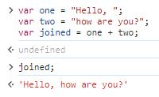
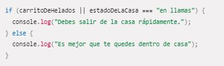
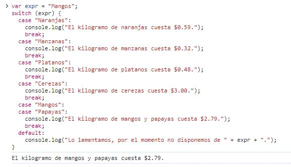
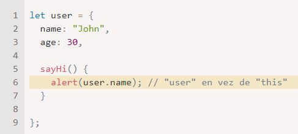

# ¿Qué diferencia a Javascript de cualquier otro lenguaje de programación?

JavaScript es un lenguaje de programación de alto nivel, interpretado y basado en prototipos. A diferencia de HTML y CSS, que se utilizan para la estructura y el diseño de un sitio web, **JavaScript se enfoca en la interacción** y la manipulación de elementos en tiempo real. Hace posible agregar **funcionalidades dinámicas** a las páginas web, como formularios interactivos, efectos visuales y actualizaciones, **sin necesidad de refrescar la página**. Fue inventado por ***Brendan Eich***, cofundador del proyecto Mozilla, Mozilla Foundation y la Corporación Mozilla.

Al ser un ***lenguaje script*** (es decir, **ejecuta secuencias de comandos**) JavaScript debe seguir el **estándar ECMA** para garantizar su operatividad en diferentes versiones de navegadores y plataformas.

***ECMAScript*** se creó para **estandarizar** JavaScript y garantizar su **compatibilidad y portabilidad**. Define la sintaxis del lenguaje, los tipos de datos, los operadores, las estructuras de control y muchos otros elementos que componen el lenguaje de programación. Además, también **especifica las API** (Interfaces de Programación de Aplicaciones) que están **disponibles** para interactuar con el entorno en el que se ejecuta JavaScript, como el acceso al DOM en el caso de JavaScript, en un navegador web.

JavaScript por sí solo es bastante compacto aunque muy flexible, y los desarrolladores han escrito gran cantidad de **herramientas** encima del núcleo del lenguaje JavaScript, desbloqueando una gran cantidad de **funcionalidad adicional** con un mínimo esfuerzo. Esto incluye:

- ***Interfaces de Programación de Aplicaciones del Navegador (APIs)***. APIs construidas dentro de los **navegadores** que ofrecen funcionalidades como crear dinámicamente contenido HTML y establecer estilos CSS, hasta capturar y manipular un vídeo desde la cámara web del usuario, o generar gráficos 3D y muestras de sonido.
- ***APIs de terceros***, que permiten a los desarrolladores **incorporar funcionalidades** en sus sitios **de otros proveedores** de contenidos como Twitter o Facebook.
- ***Marcos de trabajo y librerías de terceros*** que puedes aplicar a tu HTML para que puedas construir y publicar rápidamente sitios y aplicaciones.

### Principales características de JavaScript

1. ***JavaScript es un lenguaje interpretado.***

    Lo que significa que no necesita ser compilado antes de ser ejecutado. En otras palabras, **no necesita traducir el código fuente** (el escrito por la persona) en lenguaje de máquina para poder ejecutarse. 
    Los **navegadores web modernos tienen un motor JavaScript incorporado**  que interpreta y ejecuta el código directamente. Al ejecutarse línea por línea o en pequeñas secciones, permite que los errores se detecten y se notifiquen de inmediato.

    
    

2. ***JavaScript es de tipado débil y dinámico.***

    En JavaScript, las variables no están fuertemente tipadas, lo que significa que **no es necesario declarar explícitamente el tipo a una variable** cuando se le asigna un valor. Esto permite que el tipo de la variable pueda cambiar durante la ejecución del programa. ¡Pero ten cuidado!, el valor asignado a la variable se sobrescribirá y si no tienes un buen seguimiento del código, puede causar errores.

    

3. ***JavaScript es un lenguaje basado en prototipos.***

    La estructura basada en prototipos ofrece **flexibilidad y capacidad de herencia dinámica**. De hecho, es gracias a esta característica que JavaScript puede **emular la programación orientada a objetos**, una funcionalidad que la mayoría de las personas asocia con lenguajes como Java o C++.

    La programación orientada a objetos en JavaScript te permite **organizar y estructurar tu código** de una manera más modular y reutilizable. Puedes definir clases, crear instancias de esas clases y trabajar con ellas mediante sus propiedades y métodos.

    
    

    En este ejemplo, se define una clase llamada "Persona" que tiene dos propiedades: "nombre" y "edad". La clase también tiene un método llamado "saludar" que imprime un mensaje de saludo en la consola. 
    
    Después se crean dos instancias de la clase Persona: "persona1" y "persona2". Cada instancia tiene sus propios valores para las propiedades "nombre" y "edad". Finalmente, se llama al método "saludar" en cada instancia, lo que imprime un mensaje personalizado para cada objeto.

4. ***JavaScript usa funciones de orden superior.***

    En JavaScript, el concepto de funciones de orden superior se refiere a la capacidad del lenguaje para tratar a las funciones como **ciudadanos de primera clase**, lo que significa que las funciones pueden ser tratadas como cualquier otro valor, como números o cadenas.

    Las funciones de orden superior en JavaScript pueden realizar las siguientes acciones:

    - *Pasar funciones como argumentos*: Puedes pasar una función como argumento a otra función. Esto permite que la función receptora utilice y ejecute la función pasada como argumento en un contexto específico.
    - *Devolver funciones como resultado*: Una función puede devolver otra función como resultado. Esto permite la creación de funciones que generan y retornan funciones específicas basadas en ciertas condiciones o configuraciones.
    - *Asignar funciones a variables*: Puedes asignar una función a una variable. Esto te permite tratar a la función como cualquier otro valor y utilizarla según sea necesario.

        

    En el **primer ejemplo**, se utiliza la función ***ejecutarFuncion*** para pasar la función *saludar* como argumento y ejecutarla con el nombre específico Juan.

    En el **segundo ejemplo** de la imagen, la función **multiplicador** devuelve una función que toma un número y lo multiplica por el factor. Después, se asigna la función devuelta a la variable *duplicar*, que se usará para duplicar el 5.

    En el **tercer y último ejemplo**, se asigna la función a la variable **suma** y se utiliza para realizar una suma simple.

### ¿Para qué sirve JavaScript?

- **JavaScript sirve para la interactividad en el lado del cliente.**

    JavaScript **se ejecuta en el navegador de la persona usuaria**, lo que le permite interactuar con el contenido de una página web de forma dinámica y hacerla interactiva. Con JavaScript se puede responder a **eventos** iniciados desde el ordenador del cliente como clics, desplazamientos o pulsaciones de teclas y realizar acciones en consecuencia.

- **JavaScript sirve para la manipulación del DOM.**

    El ***Document Object Model (DOM)*** es una representación en memoria de la estructura de un documento HTML. JavaScript facilita la manipulación del DOM, lo que **permite modificar y actualizar elementos HTML en tiempo real**. Esto resulta especialmente útil al realizar validaciones de formularios, crear efectos visuales y dinámicos, y actualizar contenido sin refrescar la página completa.

- **JavaScript sirve para la interactividad en el lado del cliente.**

    JavaScript **se ejecuta en el navegador de la persona usuaria**, lo que le permite interactuar con el contenido de una página web de forma dinámica y hacerla interactiva. Con JavaScript se puede responder a **eventos** iniciados desde el ordenador del cliente como clics, desplazamientos o pulsaciones de teclas y realizar acciones en consecuencia.

    
    

    En este ejemplo, tenemos un archivo HTML simple que incluye un encabezado (”h1”) con un ID de "titulo" y un botón. El archivo JavaScript vinculado al documento contiene una función llamada **cambiarTexto()**. Cuando se hace clic en el botón, esta función se ejecuta y realiza la manipulación del DOM. 

    - Dentro de la función **cambiarTexto()** se utiliza **document.getElementById("titulo")** para obtener una referencia al elemento con el ID *titulo*.
    - Después, se modifica el contenido del elemento utilizando la propiedad *innerHTML*, asignándole el nuevo texto **"¡Hola, warrior!"**.
    - Cuando se hace **clic** en el botón, el texto del encabezado **h1** se cambia de "Hola, Mundo!" a "¡Hola, warrior!" debido a la manipulación del DOM realizada por la función **cambiarTexto()**.

- **JavaScript sirve para la comunicación con el servidor.**

    JavaScript permite realizar **solicitudes asíncronas** al servidor mediante AJAX (Asynchronous JavaScript and XML) o utilizando tecnologías más modernas como Fetch y Axios. Esto posibilita la **carga de datos en segundo plano**, **actualizaciones** en tiempo real y la construcción de **aplicaciones web** interactivas **que se comunican con el servidor sin interrupciones** perceptibles por parte de la persona usuaria.

### Ventajas y desventajas de JavaScript

# ¿Cuáles son algunos tipos de datos JS?

El último estándar ECMAScript define **siete** tipos:

- ***Undefined***: *typeof instance === "undefined"*.  
    - Una variable a la que no se le ha asignado valor es de tipo undefined.  
    - Un método o sentencia también devuelve undefined si la variable que se está evaluando no tiene asignado un valor.  
    - Una función devuelve undefined si no se ha devuelto un valor.

- ***Null***: *typeof instance === "object"*.  
El valor null es un literal de Javascript que representa intencionalmente un valor nulo o "vacío". 

- ***Boolean***: *typeof instance === "boolean"*.  
Es un dato lógico que solo puede tener los valores true o false.

- ***String***: *typeof instance === "string"*.  
    - Se utiliza para representar **datos textuales**. 
    - Es un conjunto de **elementos** de valores enteros donde cada elemento del String ocupa una posición en la cadena. El primer elemento está en el índice 0, el siguiente en el índice 1, y así sucesivamente. La longitud de una cadena es el número de elementos que contiene.
    - A diferencia de algunos lenguajes de programación (tal como C), las cadenas de JavaScript son **inmutables**. Esto significa que una vez que se crea una cadena, no es posible modificarla.

- ***Symbol***: *typeof instance === "symbol"*.  
    - Un símbolo es un **valor único e inmutable** y se puede utilizar como clave de una propiedad de objeto. En algunos lenguajes de programación, los símbolos se denominan *átomos*.
    - Se garantiza que cada llamada a **Symbol()** devuelve un único Symbol.
    - Cada llamada a **Symbol.for("key")** devolverá siempre el mismo Symbol para un valor dado de **key**.

- ***Number***: *typeof instance === "number"*.  
ECMAScript tiene **dos tipos** numéricos integrados: ***Number*** y ***BigInt***.
    - ***Number***: 
        - Permite representar y manipular **valores numéricos** cómo 37 o -9.25. 
        - El constructor Number contiene c**onstantes y métodos** para trabajar con números. 
        - Valores de otro tipo pueden ser convertidos a números usando la función **Number()**.
    - ***BigInt***: 
        - Representan valores numéricos que son muy grandes para ser representados por el tipo **number**.
        - Es creado al anexar una **n** al final de un entero o llamando a la función **BigInt()** (sin el operador new) y dándole un valor entero o un valor de cadena.
        - Difieren de **number** en que un valor BigInt no puede ser usado con métodos del objeto integrado ***Math*** y no puede ser mezclado con un valor numérico en operaciónes.

- ***Object***: *typeof instance === "object"*.  
    - En JavaScript, los objetos se pueden ver como una **colección** de propiedades, en la que luego se pueden agregar y eliminar propiedades.
    - Los valores de propiedad pueden ser **valores de cualquier tipo**, incluidos otros objetos, lo que permite construir estructuras de datos complejas.
    - Las propiedades se identifican mediante valores **clave**, que es un valor de cadena o un símbolo.

# ¿Cuáles son las tres funciones de String en JS?

Para hablar de las funciones de String en JavaScript, vamos a repasar algunos conceptos básicos de las cadenas (String) e iremos introduciendo las funciones más útiles.

A primera vista, las **cadenas (String)** se tratan de forma similar a los números, pero cuando profundizas empiezas a ver diferencias notables. Comencemos escribiendo algunas líneas de texto básicas en la consola para familiarizarnos.

1. **Creando una cadena.**

        var string = "La revolución no será televisada.";
        string;

    Al igual que con los números, declaramos una **variable**, iniciandola con el valor de una cadena, y luego retornamos dicho valor. La única diferencia es que al escribir una cadena, necesitas envolverla con **comillas**.

    Si olvidas alguna de las comillas, obtendrás un error.  

        var malString = Esto es una prueba;
        var malString = 'Esto es una prueba;
        var malString = Esto es una prueba';

    Estas líneas no funcionan porque el texto sin comillas es interpretado por el navegador como el nombre de una variable, propiedad, palabra reservada, o algo similar, que no encuentra. 
    
    Si el navegador puede ver dónde comienza una cadena, pero no dónde termina, como en la segunda oración, también devuelve un error. 
    
    Si antes definiste la variable **string**, las siguientes líneas también funcionan, donde le damos a **malString** el mismo valor que **string**.

        var malString = string;
        malString;

2. **Comillas simples vs. comillas dobles.**

    En JavaScript, puedes escoger entre comillas simples y dobles para envolver tus cadenas.

    
    
    Hay muy poca diferencia entre las dos, y la que utilices dependerá de tus preferencias personales. Sin embargo, deberías de elegir una y mantenerla, usar diferentes tipos de comillas en el código podría llegar a ser confuso, especialmente si utilizas diferentes comillas en la misma cadena.

    
   
    Sin embargo, no puedes usar el mismo tipo de comillas en el interior de una cadena que ya las tiene en los extremos. En la siguiente imagen, la primera declaración devuelve error porque confunde al navegador respecto de dónde termina la cadena.
    
    La segunda declaración es la manera correcta de usar las comillas.

    
    

3. **Concatenando cadenas.**

    **Concatenar** es una elegante palabra de la programación que significa **unir**. Para unir cadenas en JavaScript usamos el símbolo de ***más (+)***, el mismo operador que usamos para sumar números, pero en este contexto hace algo diferente. Vamos a probar un ejemplo en nuestra consola.

    

    Hemos unido dos strings, pero lo puedes hacer con cuantas desees, mientras que incluyas el símbolo de + entre ellas.

    
    
    También se puede usar una combinación de **variables** y **strings literales**.

    
    
    Veamos un ejemplo de como podemos usar la concatenación:

    En HTML tenemos un botón:
    
        <button>Press me</button>

    Y en JavaScript el siguiente código:

        var button = document.querySelector("button");

        button.onclick = function () {
            var name = prompt("What is your name?");
            alert("Hello " + name + ", nice to see you!");
        };

    Al hacer click en el botón aparecerá un cuadro emergente (también llamado pop-up), por usar la función **prompt**, que nos pedirá nuestro nombre y se almacenará en la variable **name**.

    

    Luego, por la función **alert** se mostrará otra ventana emergente con una cadena que hemos unido de la concatenación de dos string literales y la variable name.

    
    

4. **Números versus cadenas.**

    Entonces, ¿qué sucede cuando intentamos agregar (o concatenar) un string y un número?

        "Front " + 242;

        Devuelve --> 'Front 242'

    Podrías esperar que diera un error, pero funciona a la perfección. Tratar de representar un string como un número no tiene sentido, pero **representar un número como string** si que lo tiene, así que el navegador convierte el número en una string y las muestra juntas.
 
    Si tienes una variable numérica que deseas convertir en una string, o una variable string que deseas convertir a número,  puedes usar las siguientes construcciones:
    La ***función Number()*** convertirá cualquier cosa que se le pase en un número, si puede.

        var myString = "123";
        var myNum = Number(myString);
        typeof myNum;

        Devuelve --> 'number'

    Por otra parte, cada número tiene un método llamado ***toString()*** que convertirá el equivalente en una string.

        var myNum = 123;
        var myString = myNum.toString();
        typeof myString;

        Devuelve --> 'string'

    Estas construcciones pueden ser muy útiles en ciertas situaciones. Por ejemplo, si un usuario introduce un número en un campo de texto de un formulario, será un string. Sin embargo, si quieres añadir ese número a algo, necesitas convertirlo a número, así que puedes usar esta construcción para hacerlo.

5. **Encontrar la longitud de un cadena**

    Esto es fácil — simplemente usa la propiedad ***length***.

        let browserType = "mozilla";
        browserType.length;

    Esto debería devolver el número 7, porque "mozilla" tiene 7 caracteres.

    Esto es **útil** por muchas razones; por ejemplo, es posible que quieras buscar las longitudes de una serie de nombres para que puedas mostrarlos en orden de su longitud, o dejar que un usuario sepa que un nombre ingresado en un campo de formulario es demasiado largo o si tiene una longitud determinada.

6. **Extrayendo un caracter específico de la cadena.**

    Puedes devolver cualquier carácter de una cadena incluyendo **corchetes [ ]** al final del nombre de tu variable. Dentro de los corchetes, incluye el **índice o index (número del caracter, que comienza desde 0)** que deseas extraer.

    Para extraer el **último caracter** de cualquier cadena, podríamos usar ***browserType.length - 1***. El largo de *"mozilla"* es 7, pero como el index comienza en 0, la posición del último caracter es 6, por lo tanto, necesitamos **length-1**. Esto se vería así:

    
    

7. **Encontrar una subcadena dentro de una cadena y extraerla.**

    Algunas veces querrás encontrar si hay una cadena más pequeña dentro de una más grande, es decir, si un grupo de caracteres se encuentra en la cadena. Esto se puede hacer utilizando el método ***indexOf()***, que toma un único parámetro — la subcadena que deseas buscar.

    Esto nos dará un resultado de 2, porque la subcadena "zilla" comienza en la posición 2 dentro de *"mozilla"*.

    
    
    Cuando la subcadena, en este caso *'vanilla'*, no es encontrada en la cadena principal, debería darte un resultado de -1.

    Cuando sabes donde comienza una subcadena dentro de una cadena, y sabes hasta qué caracter quieres que termine, puede usarse ***slice()*** para extraerla.

    
    
    Esto devuelve *"moz"*. El **primer parámetro** es la posición del caracter en la que **comenzar a extraer**, y el **segundo parámetro** es la posición del caracter que va **después del último a extraer**.

    Además, si quieres extraer todos los caracteres que van después de **cierto caracter hasta el final**, no necesitas incluir el segundo parámetro.
8. **Cambiando todo a mayúscula o minúscula.**

    Los métodos de cadena ***toLowerCase()*** y ***toUpperCase()*** convierten todos los caracteres de una cadena a mayúscula o minúscula, respectivamente. Esto puede ser útil, por ejemplo, si deseas normalizar todos los datos introducidos por el usuario antes de almacenarlos en una base de datos. 

    
    
9. **Actualizando partes de una cadena.**

    Para finalizar vamos a ver cómo reemplazar una subcadena por otra usando el método ***replace()***.

    Necesita dos parámetros: la cadena que deseas reemplazar, y la cadena con la que deseas reemplazarla.

    

    Ten en cuenta que para obtener realmente el valor actualizado reflejado en la variable, debes usar el método dentro de la variable para que el valor obtenido sea el que queremos.

 
# ¿Qué es un condicional?

En cualquier lenguaje de programación, el código necesita **realizar decisiones** y llevar a cabo diferentes acciones acordes dependiendo de distintas entradas. Por ejemplo, en un juego, si el numero de vidas del jugador es 0, entonces se termina el juego. 

### Declaraciones if ... else

Esta es la declaración condicional más común que usarás en JavaScript.
La sintaxis básica **if...else** se ve así:

    if (condición) {
        código a ejecutar si la condición es verdadera
    } else {
        ejecuta este otro código si la condición es falsa
    }

- La palabra clave ***if*** seguida de unos ***paréntesis***.  
- Una ***condición*** a probar dentro de los paréntesis (típicamente "*¿es este valor mayor que este otro valor?*", o "*¿existe este valor?*"). 
- Esta condición usará los ***operadores de comparación*** que devuelve un valor ***true*** o ***false*** (verdadero o falso), dependiendo de si se cumple la condición o no.  

    - Vamos a revisar cuales son de forma breve:

        
        
        Como puedes observar, en los ejemplos de la tabla, todos los resultados serían **false**.

        Es posible que algunas personas utilicen **==** y **!=** en sus pruebas de igualdad y no igualdad.  
        Estos son **operadores válidos** en JavaScript, pero difieren de **===** y **!==**. Los primeros indican si los **valores** son iguales, pero el **tipo de datos** puede ser diferente; mientras que las últimas **versiones estrictas**, prueban si el valor y el tipo de datos son los mismos. Las versiones estrictas tienden a **reducir el número de errores** que no se detectan, por lo que te recomendamos que los utilices.

- Un ***conjunto de llaves***, dentro de las cuales tenemos algún código, que se ejecutará sólamente si la condición devuelve ***true***.  
- La palabra clave ***else***.  
- Otro ***conjunto de llaves***, dentro de las cuales tendremos otro código que sólo se ejecutará si la condición ***false***.

Este código es fácil de leer — está diciendo "*si (if) la condición devuelve verdadero (true), entonces ejecute el código A, si no (else), ejecute el código B*".

Habrás notado que no tienes que incluir ***else*** y el ***segundo bloque de llaves***, es opcional.  

    if (condición) {
        ejecuta el código de al ser verdadera la condición
    }

    ejecuta otro código

Sin embargo, hay que ser cuidadosos — en este caso, el segundo bloque no es controlado por una declaración condicional, así que **siempre se ejecutará**, sin importar si la condicional devuelve true o false. Esto no es necesariemente algo malo, pero puede ser algo que no quieras — a menudo desearás ejecutar un bloque de código u otro, no ambos.

Como punto final, habrán ocaciones donde veas delcaraciones if...else escritas sin un conjunto de llaves, de esta manera:

    if (condición) ejecuta código de ser verdadero (true)
    else ejecuta este otro código de ser falso (false)

Este código es perfectamente valido, pero **no es recomendable** usarlo — es mucho más fácil leer el código y determinar qué sucede haciendo uso de las llaves para delimitar los bloques de código y usar varias líneas y sangrías.

### else if 

Hay una forma de añadir ***condicionales extra*** a if ... else, usando ***else if***. 

Cada opción extra requiere un **bloque adicional**. Observa el siguiente ejemplo un poco más complicado, que podría ser parte de una aplicación para un simple pronóstico del tiempo:

Aquí tenemos un elemento **HTML** **\<select>** que nos permite realizar varias elecciones sobre el clima, y un parrafo simple.

En el **JavaScript**, estamos almacenando una **referencia** para ambos elementos **\<select>** y **\
** ,y añadiendo un ***Event Listener*** o en español un ***Detector de Eventos*** al elemento **\<select>**, así cuando su valor cambie se ejecuta la función ***establecerClima()***.  

Cuando la función es ejecutada, primero establecemos la variable ***eleccion*** con el valor obtenido del elemento **\<select>**. Luego usamos una **declaración condicional** para mostrar distintos textos dentro del párrafo **\
**, dependiendo del valor de la variable ***eleccion***. 

Fíjate en como todas las condicinales son probadas en los bloques ***else if() {...}*** ,a excepción del primero, que es probado en el primer ***bloque if() {...}***.  
La **ultima elección**, dentro del bloque ***else {...}***, es básicamente el "*último recurso*" como opción. El código dentro de este bloque se ejecutará si **ninguna de las condiciones es true**. En este caso, sirve para vaciar el contenido del párrafo si nada ha sido seleccionado; por ejemplo, si el usuario decide elegir de nuevo "*--Haga una elección--*" mostrado al inicio.

### Anidando if ... else

Está permitido poner una declaración ***if...else*** dentro de otra declaración ***if...else***, para anidarlas. 

Por ejemplo, podemos actualizar nuestra aplicación del clima para mostrar una serie de opciones dependiendo de cual sea la temperatura:

    if (elección === "soleado") {
        if (temperatura < 30) {
            parrafo.textContent =
            "Hay " + temperatura + " grados fuera — agradable y soleado. Vamos a la playa, o al parque, y a comer helado.";
        } else if (temperatura >= 30) {
            parrafo.textContent =
            "Está a " + temperatura + " grados fuera — ¡QUÉ CALOR! Si quieres salir, asegúrate de embadurnarte de crema para el sol.";
        }
    }

### Operadores lógicos: AND, OR y NOT

Si quieres probar multiples condiciones sin escribir declaraciones **if...else anidados**, los ***operadores lógicos*** pueden ayudarte.

- **&& — AND**: permite encadenar dos o más expresiones para que **todas** ellas tengan que devolver individualmente ***true***, para que la expresión entera sea ***true***.

    
    
- **|| — OR**: permite encadenar dos o más expresiones para que **una o más** de ellas tengan que devolver individualmente ***true*** para que la expresión entera devuelva ***true***.

    

- **! — NOT**: puede ser usado para **negar una expresión**, es decir, indica lo contrario. En el siguiente ejemplo, si las declaraciones del **operador OR** retornan un valor ***true***, el operador NOT **negará** toda la expresión dentro de los paréntesis, por lo tanto retornará un valor ***false***.

    

### Declaraciones con switch

La declaración ***switch*** evalúa una ***expresión***, comparando el valor de esa expresión con una instancia ***case***, y ejecuta declaraciones asociadas a ese ***case***, así como las declaraciones en los ***case*** que siguen.

Una **instancia case** es usada para ser comparada con la **expresión**. Si la expresión **coincide** con el valor de ese **case**, las declaraciones de dentro de esa instancia se ejecutan hasta que se encuentre el **final de la declaración switch** o hasta encontrar una interrupción ***break*** (la declaración break es **opcional** y está asociada con cada etiqueta de **case**; asegura que el programa salga del **switch** una vez que se ejecute la declaración que coincide con instrucción).

La instancia ***default***, cuando es declarada, es ejecutada si el valor de la expresión **no coincide** con cualquiera de las otras **instancias case**.

Si olvidas un **break**, el script se ejecutará desde donde se cumple la condición y ejecutará el siguiente case independientemente si esta condición se cumple o no.  

El último operador que vamos a revisar es el **operador ternario**, y lo haremos en la siguiente pregunta.

# ¿Qué es un operador ternario?

El ***operador ternario*** o ***condicional*** es una sintaxis reducida, que prueba una condición y devuelve un valor/expresión si es **true**, y otro si es **false**. Esto puede ser útil en algunas situaciones, ya que ocupa mucho menos código que un **bloque if...else**, si simplemente tienes **dos opciones** que se eligen a través de una condición true/false.

La sintaxis es la siguiente:

    ( condición ) ? ejecuta este código si es true : ejecuta este código si es false

Un ejemplo de su aplicación:

    let greeting = isBirthday
        ? "Feliz cumpleaños Sra. Smith. ¡Esperamos que tenga un gran día!"
        : "Buenos días señora Smith.";

Aquí tenemos una variable llamada **isBirthday**. Si esta es **true**, le damos a nuestro invitado un mensaje de feliz cumpleaños; si es **false**, le damos el saludo diario estándar.

Veamos un ejemplo más elaborado:

- Aquí tenemos un elemento ***\<select>*** para elegir un **tema** (blanco o negro), más un simple ***\<h1>*** para mostrar el título de un sitio web. 
- También tenemos una función llamada ***update()***, que toma **dos colores como parámetros**. El color de fondo del sitio web se establece en el primer color proporcionado y el color del texto se establece en el segundo color proporcionado.

- Finalmente, también tenemos un **detector de eventos** ***onchange*** que sirve para ejecutar una función que contiene un operador ternario. 
    - Comienza con la condición ***select.value === 'black'***. 
    - Si esto devuelve **true**, ejecutamos la ***función update() con parámetros de negro y blanco***, lo que significa que obtendremos un color de fondo negro y un color de texto blanco. 
    - Si devuelve **false**, ejecutamos la ***función update() con parámetros de blanco y negro***, lo que significa que el color del sitio está invertido.

 
# ¿Cuál es la diferencia entre una declaración de función y una expresión de función?

En JavaScript podemos encontrar varias maneras de crear **funciones**, por lo que vamos a verlas y así entender cuales son las diferencias entre ellas.

### Declaración de función

La **Declaración de Funciones** es, probablemente, el método más tradicional de crear funciones en JavaScript. Se caracteriza por su **sintaxis simple y directa**, donde la palabra clave ***function*** precede al ***nombre*** de la función, seguido de ***paréntesis*** que pueden incluir ***parámetros***, y finalmente, un ***bloque de código encerrado en llaves***.

")

Este método tiene la ventaja de ser ***hoisted***, lo que significa que puedes llamar a la función antes de su declaración en el código. Esto proporciona una gran flexibilidad en cómo organizas tu código.

### Expresión de función

La **expresión de función** es una técnica que permite crear funciones ***asignándolas a una variable***; es muy habitual encontrarse códigos donde los programadores *guardan funciones* dentro de variables, para posteriormente *ejecutar dichas variables* (como si fuera una función).

Observa que el nombre de la función (en este ejemplo: saludar) pasa a ser inútil, ya que si intentamos ejecutar ***saludar()*** nos dirá que no existe y si intentamos ejecutar ***saludo()*** funciona correctamente.

Ahora el nombre de la función pasa a ser el nombre de la variable, mientras que el nombre de la función desaparece y se omite, dando paso a lo que se llaman las ***funciones anónimas*** (o funciones lambda).

A **diferencia de la declaración de funciones**, las expresiones de funciones **no son hoisted**, lo que significa que debes declararlas antes de poder invocarlas.

# ¿Qué es la palabra clave "this" en JS?

La palabra clave ***this*** es una **palabra reservada** en JavaScript que podemos utilizar para referirnos al ***contexto*** en el que se invoca, por lo que su valor implícito puede variar durante la ejecución del código.

Es común que un **método de objeto** necesite acceder a la información almacenada en el objeto para cumplir su tarea. Por ejemplo, el código dentro de ***user.sayHi()*** puede necesitar el nombre del usuario user.  
Para acceder al objeto, un ***método*** puede usar la palabra clave ***this***.

El valor de ***this*** es el objeto usado para llamar al método.  
Aquí durante la ejecución de ***user.sayHi()***, el valor de **this** será ***user***.

Técnicamente, también es posible acceder al objeto sin ***this***, haciendo referencia a él por medio de la variable externa.

Pero así, el código no es confiable. Si decidimos copiar **user** a otra variable, por ejemplo ***admin = user*** y sobrescribir **user** con otra cosa, entonces accederá al **objeto incorrecto**.

Vamos a comprobarlo en la consola:

Ejecutamos el código usando **this** y vemos que devuelve el valor correcto (el que está dentro de **user**):

A continuación, comprobamos que solo cambiando ***this.name*** por ***user.name***, ya no nos devuelve el valor correcto, sino que se ha reemplazado con **null**.

