# ¿Qué tipo de bucles hay en JS?

Una de las principales ventajas de la programación es la posibilidad de crear **bucles y repeticiones** para tareas específicas, y que no tengamos que realizar el mismo código varias veces de forma manual.  
Los bucles nos permiten **simplificar nuestro código**, que sea más fácil de leer e incluso más **fácil de modificar y mantener**.

Antes de comenzar a aprender como funcionan los diferentes tipos de bucles existen, es necesario conocer algunos conceptos básicos relacionados con los bucles.

- Al igual que en los condicionales if, en los bucles se va a ***evaluar una condición*** para saber si se debe seguir repitiendo el bucle o se debe finalizar. Habitualmente, lo que se suele hacer es establecer que si la condición es **verdadera**, se vuelve a repetir el bucle. Por el contrario, si es **falsa**, se finaliza. Sin embargo, esta condición **puede variar** dependiendo de la implementación que le indique el programador.

- Otro concepto que usaremos mucho dentro de un bucle es el concepto de ***Iteración***. Esto se refiere a cada una de las **repeticiones de un bucle**. Por ejemplo, si un bucle se repite de 0 a 3, se dice que hay 4 iteraciones.

        Mucho cuidado con los bucles, porque en programación se suele empezar a contar en 0, por lo que esa es la primera iteración. Si el bucle va desde 0 a 3, hay 4 iteraciones.

- Muchas veces, los bucles que creamos incorporan un ***contador***, que no es más que algo que irá guardando un número para contar el número de repeticiones realizadas, y así finalizar cuando se llegue a otro número concreto. Dicho contador hay que **inicializarlo** (crearlo y darle un valor) antes de comenzar el bucle.

- Al igual que tenemos un contador en un bucle, también debemos tener una parte donde hagamos un ***incremento*** (o un ***decremento***) de dicho contador. Si no lo tuvieramos, el contador no cambiaría y la condición siempre sería veradera, por lo que sería imposible **salir del bucle**.

- Cuando estamos aprendiendo a programar, es muy común que cometamos un error creando el bucle y nos quedemos en un ***bucle infinito***, es decir, en una situación donde nuestro programa se queda eternamente en bucle y nunca termina. Como programadores, esta situación siempre hay que **evitarla**. Para ello, lo que debemos hacer es siempre comprobar que existe un incremento (o decremento) y que en algún momento la condición va a ser falsa y se podrá salir del bucle.

        Ten en cuenta que de producirse un bucle infinto, nuestro programa se quedará atascado y tendremos que forzar para finalizarlo. Ten siempre cuidado al crear un bucle para que no sea infinito.

## Tipos de bucles

Existen muchas formas de realizar **bucles**, vamos a ver los más basicos, que son muy similares en otros lenguajes de programación:

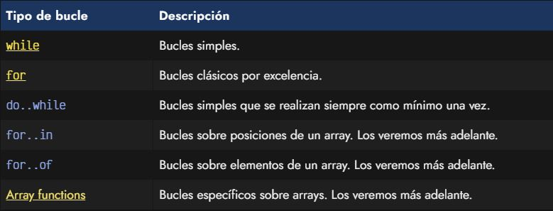

### Bucle while

El primer tipo de bucle se denomina ***bucle while***. Este bucle se caracteriza en que se repite, revisando la condición en cada iteración y sólo se detiene cuando la condición es falsa.

El bucle while es uno de los **bucles más simples** que podemos crear. Vamos a repasar el siguiente ejemplo y analizar todas sus partes, para luego analizar lo que ocurre en cada iteración del bucle. Empecemos por un fragmento sencillo del bucle:

        // Inicialización de la variable contador
        let i = 0;  

        // Condición: Mientras la variable contador sea menor de 5
        while (i < 5) {
            console.log("Valor de i:", i);

        // Incrementamos el valor de i
            i = i + 1; 
        }

1. Antes de entrar en el bucle while, se **inicializa** la variable i al valor 0.
2. Antes de realizar la primera iteración del bucle, comprobamos la **condición**.
3. Si la condición es **verdadera**, hacemos las tareas que están indentadas dentro del bucle.
4. Mostramos por pantalla el valor de i.
5. Luego, **incrementamos el valor de i** sumándole 1 a lo que ya teníamos en i.
6. **Terminamos la iteración** del bucle, por lo que volvemos al inicio del while a hacer una nueva iteración.
7. **Volvemos al punto 2**, donde comprobamos de nuevo la condición del bucle.
8. Repetimos **hasta que la condición sea falsa**. Entonces, salimos del bucle y continuamos el programa.

Una tarea que suele servir para entender mejor el bucle, es hacer una traza de lo que haría un programa internamente. Esto es ir realizando cada paso, para entenderlo bien.

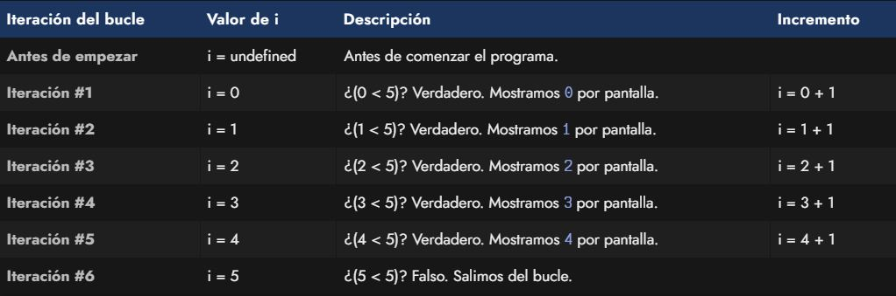

    El bucle while es muy simple, pero requiere no olvidarse accidentalmente de la inicialización y el incremento (además de la condición).  
>
    La operación i = i + 1 es lo que se suele llamar un incremento de una variable. Es muy común simplificarla como i++, que hace exactamente lo mismo: aumenta en 1 su valor.

### Bucle do ... while

Existe una variación del bucle while denominado bucle ***do while***. La diferencia fundamental, a parte de variar un poco la sintaxis, es que este tipo de bucle **siempre se ejecuta una vez**, al contrario que el bucle while que en algún caso podría no ejecutarse nunca.

Para entenderlo bien, antes de ver el bucle do while vamos a analizar el siguiente ejemplo:

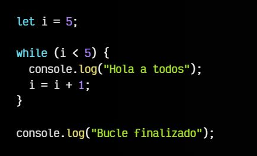

Observa, que aún teniendo un bucle, este ejemplo **nunca mostrará el texto** *Hola a todos*, puesto que la condición nunca será verdadera, porque ya ha **empezado como falsa** (i ya vale 5 desde el inicio). Por lo tanto, nunca se llega a realizar el interior del bucle.

Con el ***bucle do while*** podemos obligar a que siempre se realice el interior del bucle al menos una vez:

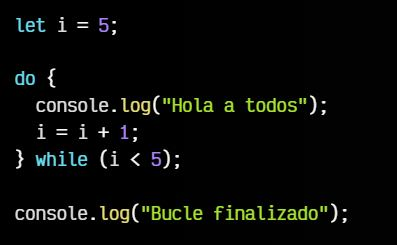

- En lugar de utilizar un while desde el principio junto a la condición, escribimos ***do***.
- El ***while con la condición*** se traslada **al final** del bucle.
- Lo que ocurre en este caso es que el interior del bucle se realiza siempre, y sólo se **analiza la condición al terminar** el bucle, por lo que aunque no se cumpla, se va a realizar al menos una vez.

### Bucle for

El ***bucle for*** es quizás uno de los **más utilizados** en el mundo de la programación. En Javascript se utiliza exactamente igual que en otros lenguajes como Java o C/C++. Veamos un ejemplo muy similar al que hemos realizado con el bucle while en el tema anterior:

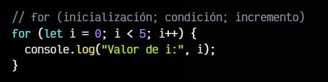

Como vemos, la **sintaxis** de un bucle for es mucho más **compacta y rápida de escribir** que la de un bucle while, sin embargo puede parecernos más críptica cuando la vemos por primera vez.

La sintaxis del ***bucle for*** es mucho más práctica porque te obliga a escribir la inicialización, la condición y el incremento **antes del propio bucle**, y eso hace que no te olvides de estos tres puntos fundamentales, cosa que suele ocurrir en los bucles while, lo que suele desembocar en un **bucle infinito**. Aunque también puede ocurrir en el bucle for, suele ser **menos habitual**.

Analicemos la sintaxis del bucle:

1. Separemos por ; lo que establecemos dentro de los paréntesis del for.
2. Lo primero es la ***inicialización*** let i = 0. Esto ocurre **sólo una vez** antes de empezar el bucle.
3. Lo segundo es la ***condición*** i < 5. Esto se comprueba **al principio de cada iteración**.
4. Lo tercero es el ***incremento*** i++, es decir, i = i + 1. Esto ocurre al **final de cada iteración**.  

### Decremento

No nos acostumbremos a hacer los bucles de memoria, ya que las condiciones pueden variar y ser diferentes. Por ejemplo, vamos a hacer un bucle que en lugar de incrementar su contador, se **decremente**, ya que nos interesa hacer una **cuenta atrás**:

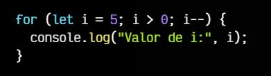

En este caso, vamos a arrancar el bucle con un **valor de i de 5**. Repetiremos la iteración varias veces, y observa que el incremento que tenemos es en su lugar un **decremento**, por lo que en lugar de sumarle 1, lo **restamos**. El valor de i iría desde 5, a 4, 3, 2, 1 y cuando se reduzca a 0, ya no cumpliría la **condición i > 0**, por lo que terminaría el bucle, saldría de él y continuaría el resto del programa.

### Incremento múltiple

Aunque no suele ser habitual, es posible añadir varias inicializaciones o incrementos en un bucle for separando por comas.

En el siguiente ejemplo además de aumentar el valor de una variable i, inicializamos una variable j con el valor 5 y la vamos decrementando:

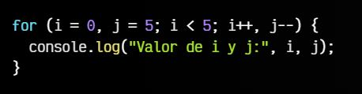

Este código sería equivalente al siguiente:

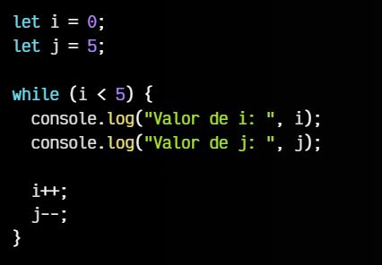

En principio, el programador debería realizar el bucle con el que más cómodo se sienta, tanto un while como un for. Sin embargo, es más común encontrarse con bucles for en el día a día, por lo que se recomienda no dejar de utilizar el for simplemente por un rechazo inicial debido a que su sintaxis pueda parecer más compleja.

### Bucle for...in

El ***bucle for...in*** es una forma especial de bucle para recorrer todas las **claves de un objeto**. Es completamente diferente al **bucle for**.

        for (key in object) {
            // se ejecuta el cuerpo para cada clave entre las propiedades del objeto
        }

Por ejemplo, mostremos todas las propiedades de user:

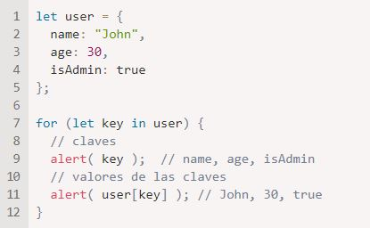

Nota que todas las construcciones ***for*** nos permiten **declarar variables** para bucle **dentro del bucle**, como *let key* aquí.

Además podríamos usar otros nombres de variables en lugar de key. Por ejemplo, "for (let prop in obj)" también se usa bastante.

### Bucle for...of

Otra de las formas de iterar los **items de un array** es el bucle ***for...of***:

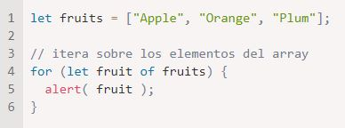

No da acceso al número del elemento en curso, solamente a su valor, pero en la mayoría de los casos eso es suficiente. Y es más corto.

Técnicamente, y porque los arrays son objetos, es también posible usar **for..in**. Pero es una mala idea. Existen problemas potenciales con esto:

- El **bucle for..in** itera sobre todas las propiedades, no solo las numéricas.  
Existen objetos que parecen arrays, esto es, tienen length y propiedades indexadas, pero pueden también tener propiedades no numéricas y métodos que usualmente no necesitemos. Y el **bucle for..in** los listará. Entonces si necesitamos trabajar con esos objetos ***simil-array***, estas propiedades *extras* pueden volverse un problema.

- El **bucle for..in** está optimizado **para objetos genéricos**, no para arrays, y es de 10 a 100 veces **más lento**. Por supuesto, es aún muy rápido. Una optimización puede que solo sea importante en cuellos de botella, pero necesitamos ser conscientes de la diferencia.

En general, **no deberíamos usar for..in en arrays**.

### Array functions

Los ***array functions*** son **métodos** que tiene cualquier variable que sea de tipo ***Array***, y que permite realizar una **operación con** todos los **elementos de dicho array** (o parte de ellos) para conseguir un objetivo concreto, dependiendo del método. En general, a dichos métodos se les pasa por parámetro una **función callback** y unos parámetros opcionales.

Estas son las Array functions que podemos encontrarnos en Javascript:

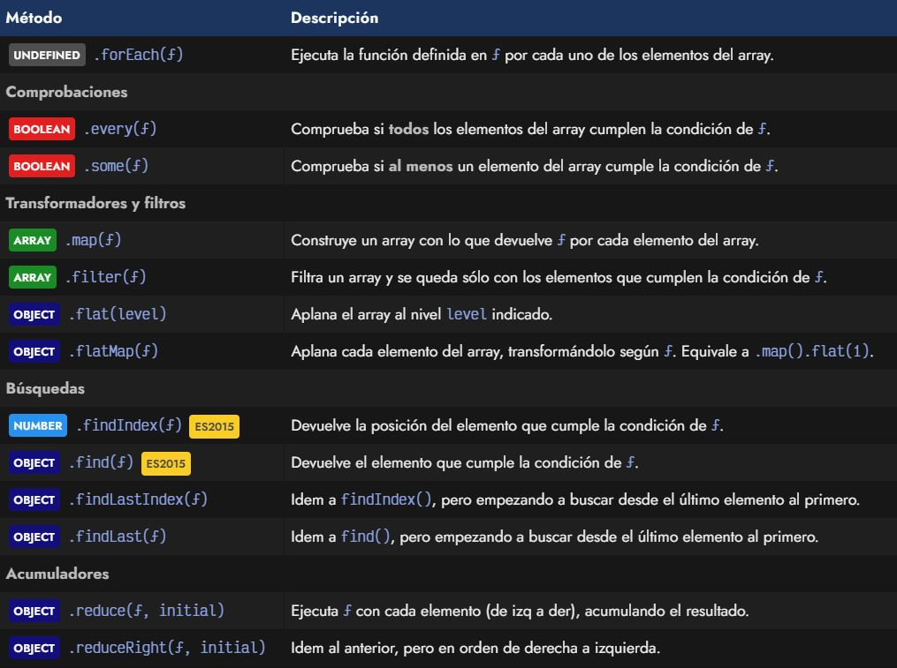

A grandes rasgos, a cada uno de estos métodos se les pasa una **función callback** que se ejecutará por **cada uno de los elementos** que contiene el array.

# ¿Cuáles son las diferencias entre const, let y var?

Al **declarar variables** en JavaScript, tienes tres opciones: ***var, let y const***. Aunque las tres palabras clave permiten declarar variables, tienen **diferentes alcances y comportamientos** que debes conocer. Echemos un vistazo a algunos ejemplos de código para ver en qué se diferencian.

## Var

**Var** es la palabra **clave original** utilizada para declarar variables en JavaScript, y ha existido **desde que se introdujo el lenguaje** por primera vez. También es la **más flexible** de las tres palabras clave, ya que permite declarar la misma variable varias veces y **reasignarle** valores.

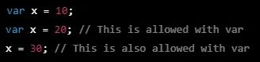

Una de las **desventajas** de var es que tiene **ámbito de función**. Esto significa que una variable declarada con var está disponible en toda la función en la que se declara. Si declaras una variable dentro de un bloque o bucle, sigue estando **disponible fuera de ese bloque** o bucle, lo que puede dar lugar a **resultados inesperados** al intentar reutilizar nombres de variables o al trabajar con funciones anidadas.

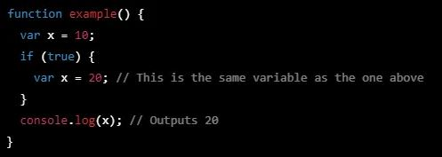

## Let

**Let** es una palabra clave relativamente nueva. Se introdujo para resolver algunos de los problemas asociados con var. La principal diferencia entre let y var es que let tiene **ámbito de bloque**. Esto significa que una variable declarada con let **sólo está disponible dentro del bloque en el que se declara**. Si se declara una variable dentro de un bloque o bucle, no estará disponible fuera de ese bloque o bucle.

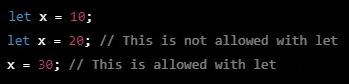

Otra diferencia entre let y var es que **no puedes declarar la misma variable varias veces** utilizando let. Esto puede ayudar a **prevenir conflictos** de nombres y hacer tu código más legible.

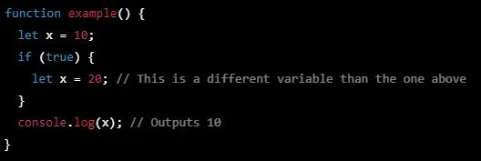

## Const

**Const** es la palabra clave para declarar constantes. Una **constante** es un valor que **no puede ser reasignado** una vez que ha sido declarado. Esto puede ser útil cuando se trabaja con **valores que nunca deben cambiar**, como las constantes matemáticas o las opciones de configuración.

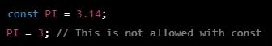

Una cosa importante a tener en cuenta sobre const es que **no hace que el valor** de la variable **sea inmutable**. Si declaras un objeto o un array usando const, todavía **puedes modificar las propiedades** de ese objeto o array. Sin embargo, **no puedes reasignar la propia variable**.

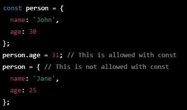

En resumen, **var** es la palabra clave más **flexible**, pero también la más **propensa a errores** para declarar variables en JavaScript. **let** es una palabra clave más reciente que proporciona **ámbito de bloque** y evita conflictos de nombres. **const** se utiliza para declarar **constantes** que no deben reasignarse. Si eliges la palabra clave adecuada para tus variables, podrás escribir código más fácil de leer y mantener.

# ¿Qué es una función de flecha?

Las ***funciones de flecha***, o ***arrow functions*** son una alternativa compacta de definir funciones, pero es limitada y no se puede utilizar en todas las situaciones.  

Simplemente, los **parámetros** se encuentran a la **izquierda** de **=>**, se evalúan y devuelven la **expresión** del lado **derecho**.  

Las **funciones de flecha** pueden parecer desconocidas y poco legibles al principio, pero eso cambia rápidamente a medida que los ojos se acostumbran a la estructura.

## Sintaxis.

Hay distintas variantes en la sintaxis:

1. **Función de un solo parámetro.**  
Al crear una función flecha de un solo parámetro **no es necesario escribir los paréntesis** y con expresiones simples no es necesario el **return**.  
Tampoco es necesario incluir las **llaves** cuando la función es de **una sola línea**.  
    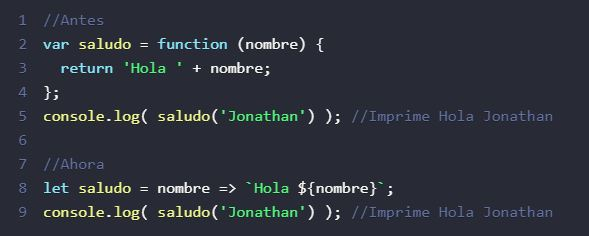  

2. **Función de varios parámetros.**  
Cuando la función tenga más de un parámetro es necesario añadirlos entre **paréntesis**.  
    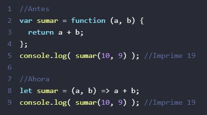

3. **Función sin parámetros.**  
Cuando la función no reciba parámetros también son necesarios los **paréntesis**, aunque estén vacíos.  
    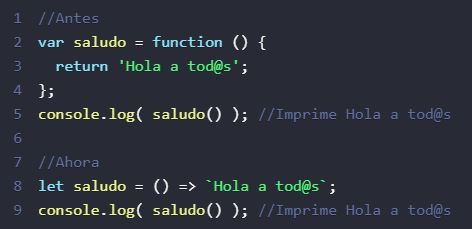

4. **Función multilínea.**  
Cuando la función tiene más de una línea es necesario utilizar las **llaves**, y si devuelve un valor hay que incluir el **return**.  
    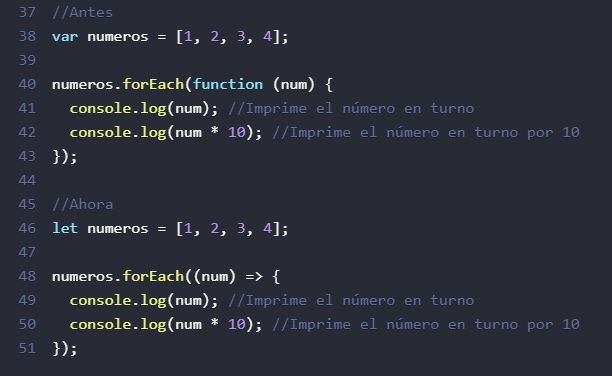
    
        let sum = (a, b) => {  // la llave abre una función multilínea
            let result = a + b;
            return result; // si usamos llaves, entonces necesitamos un "return" explícito
        };

        alert( sum(1, 2) ); // 3

## Diferencias y limitaciones.

- ***No tiene sus propios enlaces a this o super y no se deben usar como métodos.***
    
    Una de las razones por las que se introdujeron las funciones flecha fue para **eliminar complejidades** del **ámbito (this)** y hacer que la ejecución de funciones sea mucho más intuitiva.
    
    En las **funciones tradicionales** de manera predeterminada this está en el ámbito de **window**:
    
    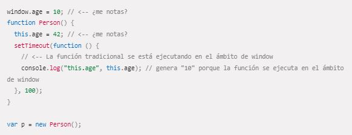

    Las **funciones flecha** no predeterminan this al ámbito o alcance de **window**, más bien se ejecutan en el ámbito o alcance en que se crean:

    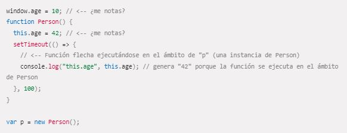
    
    

- ***No tiene argumentos o palabras clave new y no se puede utilizar como constructor.***  

    Las funciones flecha no tienen su propio objeto **arguments**. Por tanto, en este ejemplo, arguments simplemente es una referencia a los argumentos del ámbito adjunto:

    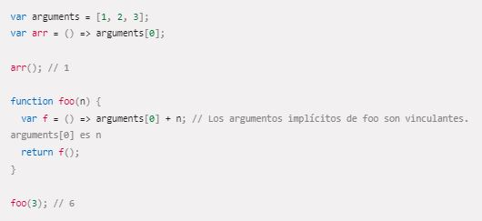
    
    En la mayoría de los casos, usar **parámetros rest** es una buena alternativa a usar un objeto arguments.

    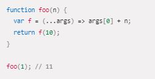
    
    Las funciones flecha no se pueden usar como **constructores** y arrojarán un error cuando se usen con **new**.

    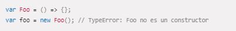
    

- ***No apta para los métodos call, apply y bind, que generalmente se basan en establecer un ámbito o alcance***  

    Los métodos **call, apply y bind no son adecuados** para las funciones flecha, ya que fueron diseñados para permitir que los métodos se ejecuten dentro de diferentes ámbitos.  
    No obstante, las funciones flecha establecen **this** según el ámbito dentro del cual se define.

- ***No se puede utilizar yield dentro de su cuerpo.***  

    La palabra clave **yield** no se puede utilizar en el cuerpo de una función flecha (excepto cuando está permitido dentro de las funciones anidadas dentro de ella). Como consecuencia, las funciones flecha no se pueden utilizar como **generadores**.

# ¿Qué es la deconstrucción de variables?

Es una de las estrategias más utilizadas al trabajar en Javascript nativo (o en frameworks como React) debido a que en Javascript se utilizan muchísimo las estructuras de datos de objetos y es muy interesante **simplificar** lo máximo posible.

Imaginemos que tenemos una **estructura de datos** que es un objeto. Utilizando la **desestructuración** de objetos podemos **separar en variables las propiedades** que teníamos en el objeto:

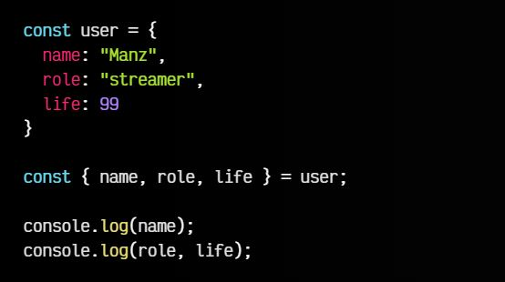

        Devuelve:
        
        "Manz"
        "streamer" 99

En este ejemplo, **separamos las propiedades** name, role y life en variables individuales, *sacándolas* de **user**.  
Observa también, que en lugar de hacer varios **console.log()** como tenemos en las dos últimas líneas, podemos hacer lo siguiente:

    console.log({ name, role, life });

    // [object Object] 

    {
    "name": "Manz",
    "role": "streamer",
    "life": 99
    }

En esta línea, **volvemos a estructurar** en un objeto, uniendo las diferentes variables en un objeto a la hora de mostrarlo por consola.

También es posible **renombrar las propiedades** si lo deseamos:

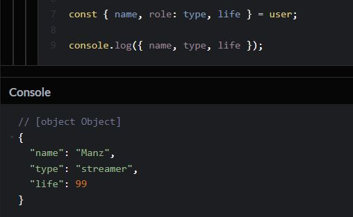

Para los casos en los que una de esas propiedades no exista (o tenga un valor undefined), también podemos establecerle un **valor por defecto** como solemos hacer en los parámetros de una función, de la siguiente forma:

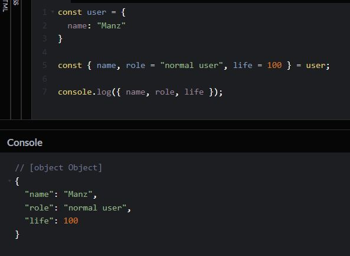

Esto hará que, si no existe la **propiedad role** en el objeto user, se cree la variable role con el  "normal user".

# ¿Qué hace el operador de extensión en JS?

Con el lanzamiento de **ECMAScript 6 (ES6)**, se introdujeron un montón de nuevas funciones y mejoras sintácticas en JavaScript. Una de ellas es el ***operador spread (operador de extensión)***, que ha ganado popularidad rápidamente entre los desarrolladores por su versatilidad y concisión.

El ***operador spread*** en JavaScript es una sintaxis que te **permite propagar los elementos de un iterable** (como arrays, cadenas u objetos), en otro iterable o llamada a función.

Se denota con **tres puntos ...** seguidos de una **expresión o un iterable**.  
Puede utilizarse para concatenar arrays, crear copias superficiales de arrays, convertir cadenas en arrays de caracteres, fusionar o clonar objetos y pasar dinámicamente valores a funciones o constructores, entre otros casos de uso.  
Simplifica las operaciones complejas y permite un código más expresivo y eficiente. 

## Ejemplos de uso del operador spread

### Concatenar Arrays

Puedes utilizar el operador spread para **distribuir los elementos de un array** en otro array. Esto es especialmente útil para concatenar arrays o crear una copia superficial de una array.

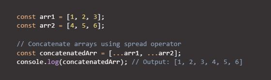

### Extendiendo Cadenas de Texto

Puedes utilizar el operador spread para **desglosar los caracteres** de una cadena en un array. Esto es útil para convertir una cadena en un array de caracteres, que puede manipularse o combinarse con otros arrays utilizando métodos de array.

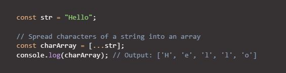

### Fusionar y Clonar Objetos

Puedes utilizar el operador spread para propagar las propiedades de un objeto en otro objeto. Esto es útil para **fusionar o clonar objetos**, crear un nuevo objeto con algunas propiedades anuladas o extraer propiedades específicas de un objeto.

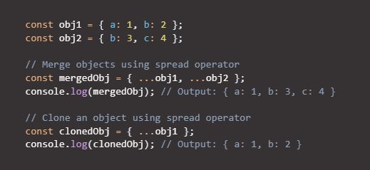

### Extender Argumentos de Función

El operador spread también puede ser usado en otros contextos, como los **argumentos de una función**, para pasar valores de manera dinámica a una función o constructor.

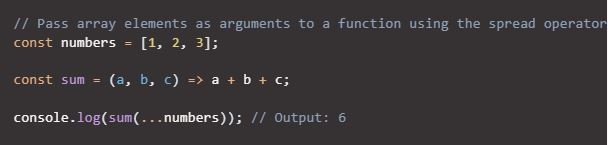

### Combinación del Operador Spread con el Parámetro rest

El operador spread puede utilizarse **junto con otras funciones** modernas de JavaScript, como la desestructuración de arrays y objetos, para habilitar potentes técnicas de programación funcional. Te permite extraer y manipular elementos de arrays o propiedades de objetos con una sintaxis concisa y expresiva.

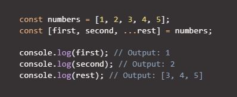

## Consejos de uso

Ten en cuenta que el **operador spread** crea **copias superficiales** de matrices y objetos, y puede tener implicaciones de **rendimiento** cuando se utiliza con arrays u objetos grandes.

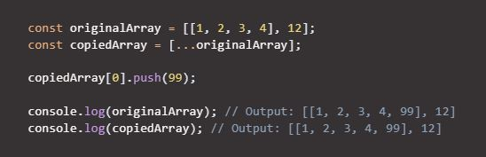  

En este código, tenemos un array ***originalArray*** con cuatro elementos y, utilizando el **operador spread**, creamos un nuevo array ***copiedArray***, clonando en él los elementos de ***originalArray***. A continuación, modificamos el primer elemento de ***copiedArray*** añadiendo 99 con el método **push**.  
Cuando obtengas la salida de ***copiedArray***, se mostrará que se ha añadido 99 al array del primer elemento, pero hay un problema con la **copia superficial** que hace el operador spread. El ***cambio en copiedArray afecta a originalArray***.

Esto se debe a que el **operador spread** no crea copias completamente nuevas de los elementos o propiedades, sino que ***comparte referencias*** a los elementos o propiedades originales. Esto puede tener **implicaciones de rendimiento** cuando se trabaja con arrays u objetos grandes.  
Por lo tanto, si trabajas con **arrays u objetos grandes**, o si necesitas hacer modificaciones profundas en el array u objeto copiado sin afectar al original, quizá debas **considerar otros enfoques** para manejar estructuras de datos complejas.

Resumiendo:

- Evita extender arrayas u objetos grandes, especialmente en rutas de código críticas para el rendimiento.

- Ten en cuenta los posibles efectos secundarios al extender objetos anidados, y considera la posibilidad de utilizar técnicas de clonación profunda si es necesario.

- Utiliza el operador spread con criterio y considera enfoques alternativos si el rendimiento es un problema.

# ¿Qué es la programación orientada a objetos?

## Definición y conceptos

La ***Programación Orientada a Objetos (POO, o en inglés OOP)*** es un estilo de programación muy utilizado, donde **creas y utilizas estructuras de datos** de una forma muy similar a la vida real, lo que facilita considerablemente la forma de planificar y preparar el código de tus programas o aplicaciones.

Cuando comenzamos a programar, nuestros ejemplos son bastante sencillos y faciles de controlar y modificar. Sin embargo, a medida que tenemos que programar cosas más complejas, todo se vuelve más **complicado de organizar**. Uno de los ***problemas*** más faciles de observar, es que comenzamos a tener una **gran cantidad de variables y funciones**, que al estar **inconexas** en nuestro código, es fácil que al seguir añadiendo más variables y funciones, nuestro código se descontrole y se vuelva muy difícil de entender.  

Por esa razón, necesitamos una **forma de organizar** las variables y constantes, las funciones y tenerlo todo bien agrupado, de modo que con el tiempo, sea sencillo de entender, modificar y ampliar. Esa agrupación, en programación, se denomina ***Clase***.

El concepto de ***orientación a objetos*** se ve muy claro cuando tenemos en nuestra mente el concepto de ***Clase***. Todos los elementos relacionados con esa Clase los vamos a incluir en su interior. Por un lado, las variables y constantes que teníamos ***sueltas*** en nuestro programa, las **agruparemos dentro de una clase**, donde también incluiremos todas las funciones.

- Las **variables y constantes** incluidas en una clase se denominan ***propiedades***, y se utilizan para **guardar información** relacionada (se suele denominar estado). 

- Por otro lado, las **funciones** incluidas en una clase se denominan ***métodos*** y se utilizan para **realizar una acción** relacionada con la clase.

## Ejemplo

Piensa, por ejemplo, en el **protagonista** (héroe) de un juego. Tiene una serie de **variables relacionadas con él** (vidas, fuerza, energía, etc...), pero también tiene una serie de **funciones relacionadas con él** (hablar, disparar, curar, etc...). Todas ellas, las podríamos **agrupar en una clase** porque tienen relación con ese concepto de ***personaje***:

    Personaje
    ----------

    - Vidas restantes (propiedad)      # Número de vidas que le quedan al personaje
    - Fuerza (propiedad)               # Número que representa la fuerza del personaje
    - Energía (propiedad)              # Número que representa la energía de la vida actual
    - Velocidad (propiedad)            # Número que representa la velocidad actual del personaje  

    - Hablar (método)                  # Función que hará que el personaje diga algo
    - Disparar (método)                # Función que hará que el personaje dispare con su arma
    - Curar (método)                   # Función que hará que el personaje use un botiquín

Sin embargo, el concepto de ***Clase*** es un **concepto abstracto**. En el juego, por ejemplo, podríamos tener **dos héroes** que podemos elegir al principio. Ambos héroes tienen los **mismos atributos y funciones**, pero son dos personajes **diferentes**. Por esa razón, en la programación orientada a objetos se tiene un concepto llamado ***Clase*** y otro concepto llamado ***Objeto***:

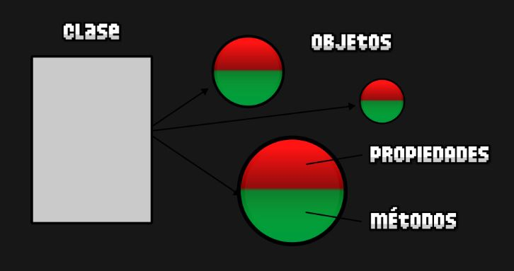

- La ***Clase*** se refiere al concepto abstracto de **personaje**. - El ***objeto*** se refiere a un **elemento particular**.  

Por ejemplo, Mario y Luigi serían los ***objetos***, ya que ambos se basan en la ***clase*** ***Personaje***, pero tienen sus **detalles particulares** (Mario podría tener más vida, o Luigi más energía, diferentes velocidades, etc...).

Veamos un código sencillo de ejemplo:

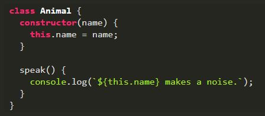

Podemos observar la clase ***Animal*** declarada con **class**, el **constructor** para crear e inicializar una **instancia** a partir de la clase y el **método** speak.

## Principios fundamentales de la POO

- ***Abstracción***  
    En JavaScript se refiere a la habilidad de un programa para **manipular y trabajar con objetos de manera genérica**, sin tener que conocer los detalles de su implementación concreta. Esto permite escribir código que se pueda **aplicar a diferentes tipos de objetos**, y no solo a uno en particular.

- ***Encapsulamiento***  
    Aunque no es tan estricto en JavaScript como en algunos lenguajes, implica **ocultar ciertos detalles y exponer solo lo que es necesario**. El uso de **scopes (ámbitos) y closures (cierres)** puede ayudar a lograr cierto nivel de encapsulamiento.  
    Este mecanismo nos permite realizar **modificaciones sobre una clase** sin que repercuta en el resto del programa. Imagina que **refactorizamos** (optimizar el código sin cambiar su contenido) un **método de una clase** que tenía un mal rendimiento, y terminamos disponiendo de otros tres que hacen su misma función, pero ahora de modo más eficiente. 

- ***Herencia***  
    Es un concepto clave en POO que permite a una clase **heredar propiedades y métodos** de otra clase. En JavaScript, la herencia se logra mediante el uso de la palabra clave ***extends*** y permite que una clase hija herede las propiedades y métodos de una clase padre.

    Siguiendo el ejemplo anterior, veamos una ***clase hija o heredada***, en la que modificamos el comportamiento del método **speak** para obtener otro resultado.

    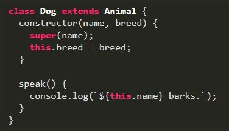

- ***Polimorfismo***  
    Se refiere a la capacidad de diferentes objetos de **responder al mismo mensaje o método de manera diferente**. Esto permite a una función o método tener comportamientos diferentes dependiendo del tipo de objeto con el que se llame, **redefiniendo un método en una clase heredada**.

## Beneficios de la POO en JavaScript
    
- Reutilización de código: La capacidad de crear plantillas de objetos facilita la reutilización de código, lo que ahorra tiempo y esfuerzo en el desarrollo.

- Mantenibilidad: La organización en objetos y clases facilita la comprensión y el mantenimiento del código, ya que se puede identificar y corregir errores con mayor facilidad.

- Escalabilidad: La POO permite la creación de aplicaciones escalables y modulares, lo que simplifica la adición de nuevas funcionalidades sin afectar el código existente.

# ¿Qué es una promesa en JS?

Las promesas son un concepto para resolver el problema de ***asincronía*** de una forma mucho más elegante y práctica que, por ejemplo, utilizando **funciones callbacks** directamente.

Como su propio nombre indica, una promesa es algo que, en principio **pensamos que se cumplirá**, pero en el futuro pueden ocurrir varias cosas:

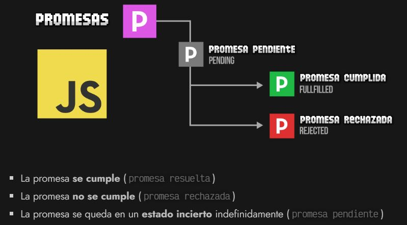

Las promesas en Javascript se representan a través de un ***Objeto***, y cada promesa estará en un **estado: pendiente, aceptada o rechazada**. Además, cada promesa tiene los siguientes métodos:

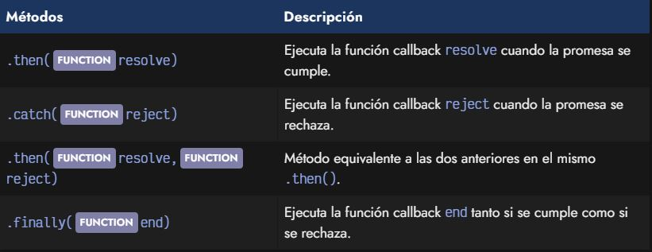

## Crear promesas

Creamos un nuevo ***objeto Promise*** que **envuelve** toda la función **doTask()**.

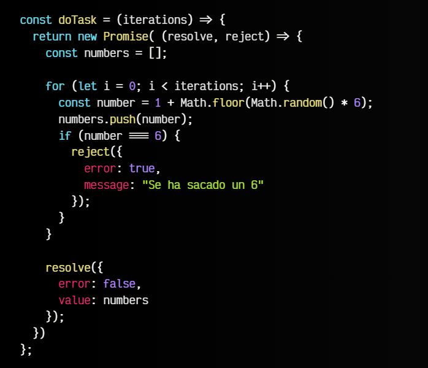

Al ***new Promise()*** se le pasa por parámetro una función con dos **callbacks**:

- El primer callback, ***resolve***, lo utilizaremos cuando se ***cumpla*** la promesa.
- El segundo callback, ***reject***, lo utilizaremos cuando se ***rechace*** la promesa.

## Consumir promesas

La forma general de consumir una promesa es utilizando el ***.then()*** con un sólo parámetro, puesto que muchas veces lo único que nos interesa es realizar una acción cuando la **promesa se cumpla**:

    fetch("/robots.txt").then(function(response) {
        /* Código a realizar cuando se cumpla la promesa */
    });

Lo que vemos en el ejemplo anterior es el uso de la ***función fetch()***, la cuál devuelve una **promesa que se cumple cuando obtiene respuesta de la petición** realizada. De esta forma, estaríamos preparando (de una forma legible) la forma de actuar de nuestro código a la respuesta de la petición realizada, todo ello de forma **asíncrona**.

Podemos hacer uso del método ***.catch()*** para actuar cuando se **rechaza una promesa**:

    fetch("/robots.txt")
        .then(function(response) {
            /* Código a realizar cuando se cumpla la promesa */
        })
        .catch(function(error) {
            /* Código a realizar cuando se rechaza la promesa */
        });    

Observa como hemos **indentado** los métodos .then() y .catch(), ya que se suele hacer así para que sea mucho **más legible**. Además, se pueden **encadenar varios .then()** si se siguen generando promesas y se devuelven con un ***return***:

    fetch("/robots.txt")
        .then(response => {
            return response.text(); // Devuelve una promesa
        })
        .then(data => {
            console.log(data);
        })
        .catch(error => { /* Código a realizar cuando se rechaza la promesa */ });

No olvides indicar el ***return*** para poder encadenar las siguientes promesas con .then(). Tras un ***.catch()*** también es posible encadenar .then() para continuar procesando promesas.

De hecho, usando ***arrow functions*** se puede mejorar aún más la legibilidad de este código, recordando que cuando sólo tenemos una sentencia en el cuerpo de la arrow function hay un **return implícito**:

    fetch("/robots.txt")
        .then(response => response.text())
        .then(data => console.log(data))
        .finally(() => console.log("Terminado."))
        .catch(error => console.error(data));

Observa además que hemos añadido el método ***.finally()*** para añadir una **función callback** que se ejecutará tanto si la promesa se cumple o se rechaza, lo que nos ahorrará tener que repetir la función en el .then() como en el .catch().

## Código no bloqueante

Algo muy importante es que el código que ejecutamos en el interior de un ***.then()*** es código ***asíncrono no bloqueante***:

- Asíncrono: Porque probablemente no se ejecuterá de inmediato, sino que **tardará en ejecutarse**.
- No bloqueante: Porque mientras espera ser ejecutado, **no bloquea** el resto del programa.

Esto significa que cuando llegamos a un ***.then()***, el sistema no se bloquea, sino que **deja la función pendiente** hasta que se cumpla la promesa, pero mientras, continua procesando el resto del programa.

# ¿Qué hacen async y await por nosotros?

Las palabras clave ***async/await*** no son más que otra manera de **gestionar las promesas**, de una forma más similar a lo que solemos estar acostumbrados.  
Recordemos un fragmento de código donde manejamos promesas mediante **.then()**:

    fetch("/robots.txt")
        .then(response => response.text())
        .then(data => console.log(data));

    console.log("Código síncrono.");

Con ***async/await*** seguimos manejando promesas, sin embargo, hay **ciertos cambios** importantes:

- **No encadenamos mediante .then()**, sino que usamos un sistema más tradicional.
- Abandonamos el modelo no bloqueante y pasamos a uno **bloqueante**.

## Await

Vamos a modificar el fragmento de código anterior, para manejar la **promesa que devuelve el fetch()**, pero en lugar de gestionarla con .then(), lo haremos con ***await***. Simplemente, a cualquier promesa que tengamos, le añadimos la palabra clave await antes.

    const response = await fetch("/robots.txt");
    const data = await response.text();
    console.log(data);

    console.log("Código síncrono.");

Lo que hace await es **detener la ejecución** y no continuar. Se espera a que se **resuelva la promesa**, y hasta que no lo haga, no continua. A diferencia del .then(), aquí tenemos un **código bloqueante**.

Ahora, vamos a introducir este fragmento de código dentro de una función llamada ***request()***. Quedaría de la siguiente forma:

    function request() {
        const response = await fetch("/robots.txt");
        const data = await response.text();
        return data;
    }

    request();

Aquí tenemos un problema. Estamos utilizando **await (asíncrono)** dentro de **request() (síncrono)**, por lo que antes de ejecutarla, al intentarla definir, nos aparecerá el siguiente error:

    Uncaught SyntaxError: await is only valid in async functions and the top level bodies of modules

## Async

Para resolver el problema anterior y poder utilizar el await dentro de nuestra función, sólo tenemos que definir nuestra función como **función asíncrona** añadiendo la palabra clave ***async*** y al llamarla utilizar nuevamente el await:

    async function request() {
        const response = await fetch("/robots.txt");
        const data = await response.text();
        return data;
    }

    await request();

Sin embargo, probemos a definir dos funciones básicas exactamente iguales, ambas devuelven lo mismo, pero una es síncrona y otra asíncrona:

    function sincrona() { return 42; }
    async function asincrona() { return 42; }

    sincrona();   // 42
    asincrona();  // Promise <fulfilled>: 42

En el caso de la **función sincrona()** devuelve directamente el **valor**, sin embargo, en el caso de la **función asincrona()** **devuelve una promesa** que se ha cumplido inmediatamente, con el valor 42.

Podemos reescribirlas como ***arrow function***, las definimos como vemos a continuación, colocando el async justo antes de los parámetros de la arrow function:

    const sincrona = () => 42;
    const asincrona = async () => 42;

Recuerda que en el caso de querer controlar errores o promesas rechazadas con async/await, siempre podrás usar bloques ***try/catch***.